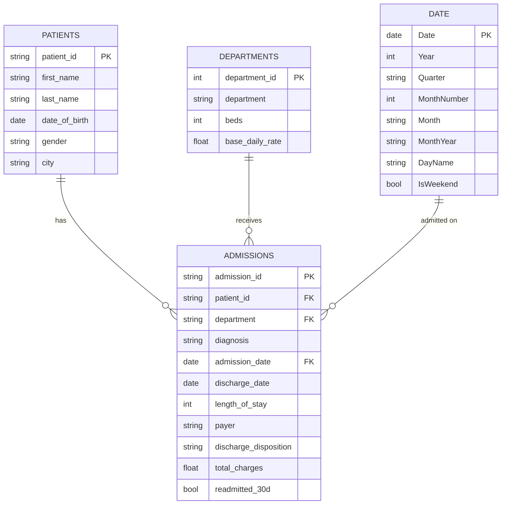

# Data model

Star schema. `Admissions` is the single fact table; everything else is a dimension.

## Relationships (Model view)

| From | To | Cardinality | Direction |
|------|----|-------------|-----------|
| Admissions[patient_id] | Patients[patient_id] | Many to one | Single |
| Admissions[department] | Departments[department] | Many to one | Single |
| Admissions[admission_date] | Date[Date] | Many to one | Single |

After wiring these up: right-click the `Date` table > **Mark as date table** (required for the `DATEADD`/`TOTALYTD` measures).

## Data dictionary

### admissions.csv — 12,236 rows (fact)
| Column | Type | Notes |
|--------|------|-------|
| admission_id | text | PK, e.g. A000001 |
| patient_id | text | FK to patients |
| department | text | FK to departments |
| diagnosis | text | Free-text diagnosis label |
| admission_date | date | 2024-01-01 → 2026-08-30 |
| discharge_date | date | admission_date + length_of_stay |
| length_of_stay | integer | Days, 1–45 |
| payer | text | Medicare / Medicaid / Private Insurance / Self-Pay |
| discharge_disposition | text | Home / Home Health / Skilled Nursing / Rehab / Expired |
| total_charges | decimal | USD |
| readmitted_30d | boolean | TRUE if a follow-up admission occurred within 30 days of discharge |

### patients.csv — 5,000 rows
patient_id (PK), first_name, last_name, date_of_birth, gender, city. All synthetic.

### departments.csv — 8 rows
department_id (PK), department, beds, base_daily_rate.

> **Privacy note:** every row is generated by `data/generate_data.py` (seed 7). No real patient data is used or stored anywhere in this project.
